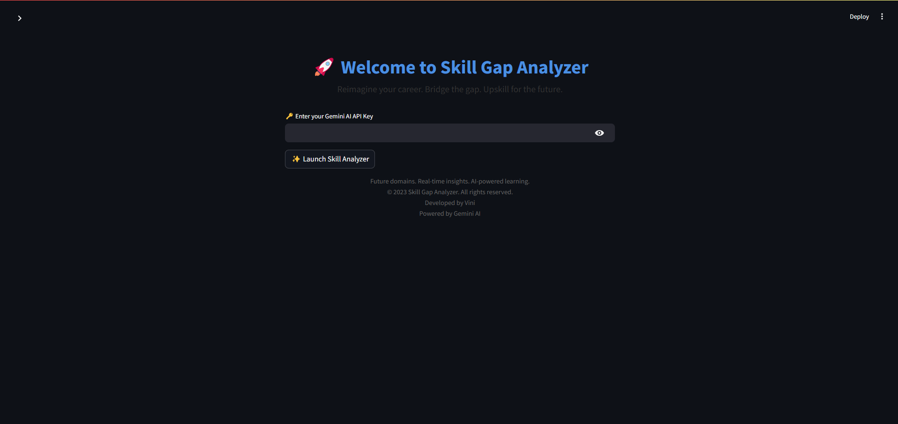
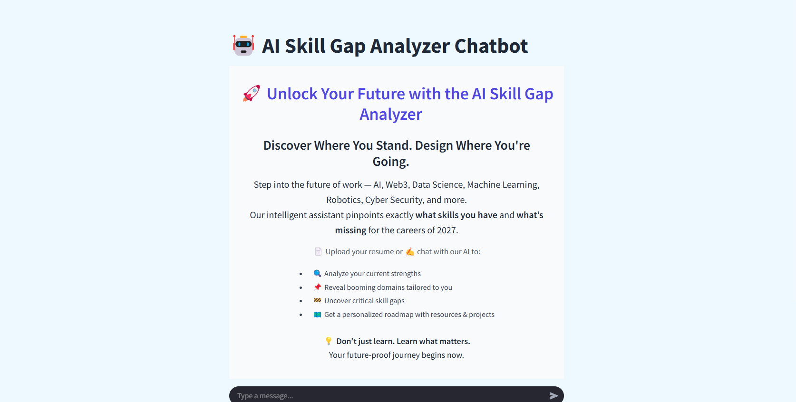
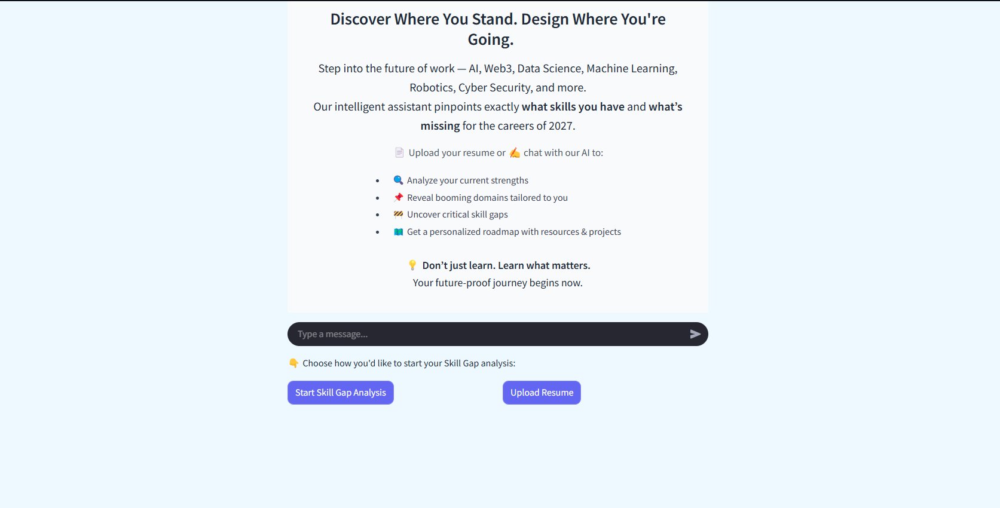
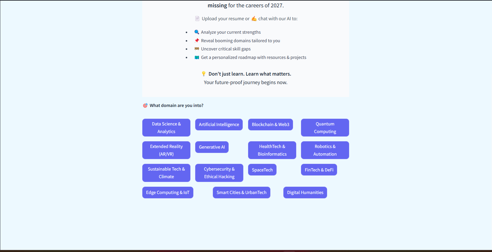
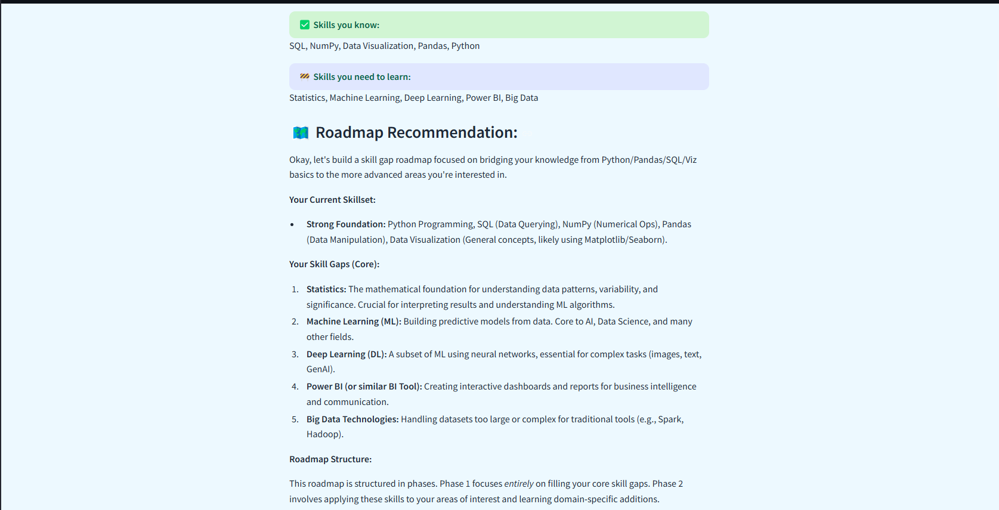
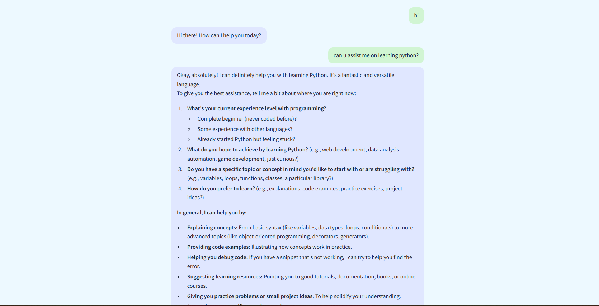
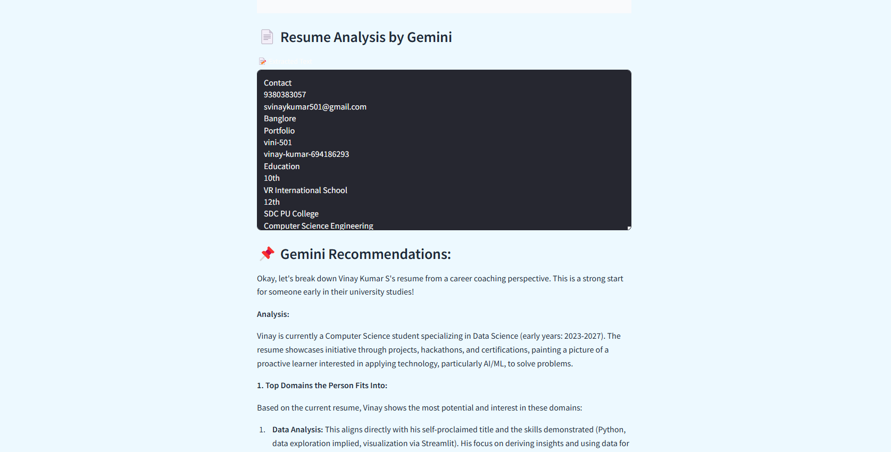
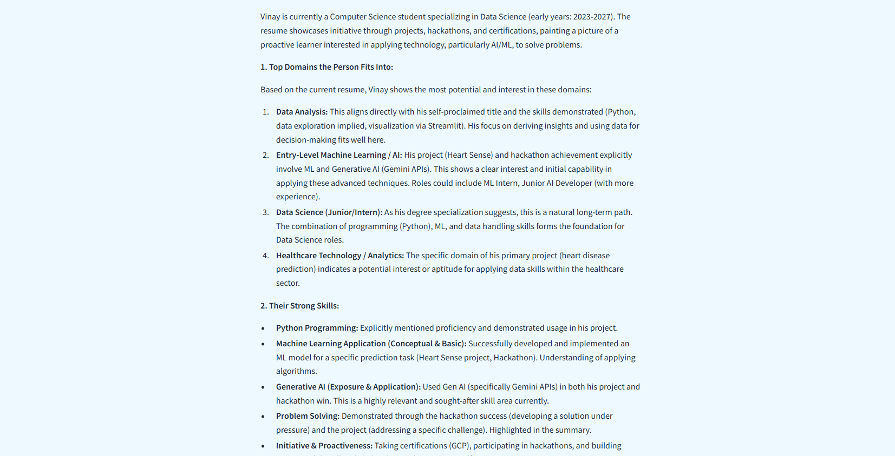

# 🚀 AI Skill Gap Analyzer

The **AI Skill Gap Analyzer** is a Streamlit-based application designed to help users identify their skill gaps and provide personalized learning roadmaps for career growth. It leverages AI-powered tools to analyze user input, resumes, and career goals to recommend actionable steps for skill development.

Try it !
Its deployed ::: https://skillgapanalyzerchatbot-vini.streamlit.app/

---

## ✨ Features

- **Chatbot Interface**: A user-friendly chatbot powered by Gemini AI to interact with users and guide them through the process.
- **Resume Analysis**: Upload your resume to identify existing skills and areas for improvement.
- **Skill Gap Analysis**: Compare your current skills with the requirements of your chosen domain.
- **Personalized Learning Roadmap**: Receive tailored recommendations for courses, tutorials, and resources to bridge your skill gaps.
- **Multi-Domain Support**: Analyze skills for various domains such as Data Science, Web Development, Cyber Security, and more.

---

## Installation

Follow these steps to set up and run the application locally:

1. **Clone the Repository**:

   ```bash
   git clone https://github.com/vini-501/Skill_Gap_Analyzer_ChatBot.git
   ```

2. **Navigate to the Project Directory**:

   ```bash
   cd Skill_Gap_Analyzer_ChatBot
   ```

3. **Install Dependencies**:
   Ensure you have Python installed. Then, install the required Python packages:

   ```bash
   pip install -r requirements.txt
   ```

4. **Run the Application**:
   Start the Streamlit app:

   ```bash
   streamlit run index.py
   ```

5. **Access the App**:
   Open your browser and navigate to the URL provided by Streamlit (usually `http://localhost:8501`).

---

## Usage

1. **Start the App**:
   Launch the app and interact with the chatbot interface.
2. **Select a Domain**:
   Choose a domain (e.g., Data Science, Web Development) to analyze your skills.

3. **Upload Your Resume**:
   Upload your resume to extract and analyze your existing skills.

4. **View Skill Gap Analysis**:
   The app will compare your skills with the requirements of your chosen domain and highlight gaps.

5. **Get a Learning Roadmap**:
   Receive personalized recommendations for courses, tutorials, and resources to improve your skills.

---

## Project Structure

```
chat-bot/
├── index.py                ← Landing page
├── pages/
│   └── Skill_Gap_Analyzer.py  ← Main app
├── utils/
│   └── skills.py           ← skill_map + domains
├── assets/
│   └── screenshot.png
├── README.md
├── requirements.txt

```

---

## Dependencies

The application requires the following Python packages:

- `streamlit`: For building the web app interface.
- `google-generativeai`: For interacting with Gemini AI.
- `PyMuPDF`: For parsing and analyzing PDF resumes.
- `streamlit-extras`: For additional Streamlit features.

Install all dependencies using:

```bash
pip install -r requirements.txt
```

---

## Contributing

Contributions are welcome! If you'd like to contribute to this project, please follow these steps:

1. Fork the repository.
2. Create a new branch for your feature or bug fix:
   ```bash
   git checkout -b feature-name
   ```
3. Commit your changes:
   ```bash
   git commit -m "Add feature-name"
   ```
4. Push to your branch:
   ```bash
   git push origin feature-name
   ```
5. Open a pull request.

---

## License

This project is licensed under the MIT License. See the `LICENSE` file for details.

---

## Contact

For questions or feedback, please contact:

- **Name**: Vinay Kumar S
- **Email**: [svinaykumar501@gmail.com]
- **GitHub**: [https://github.com/vini-501](https://github.com/your-username)

---

## Screenshots (Optional)









